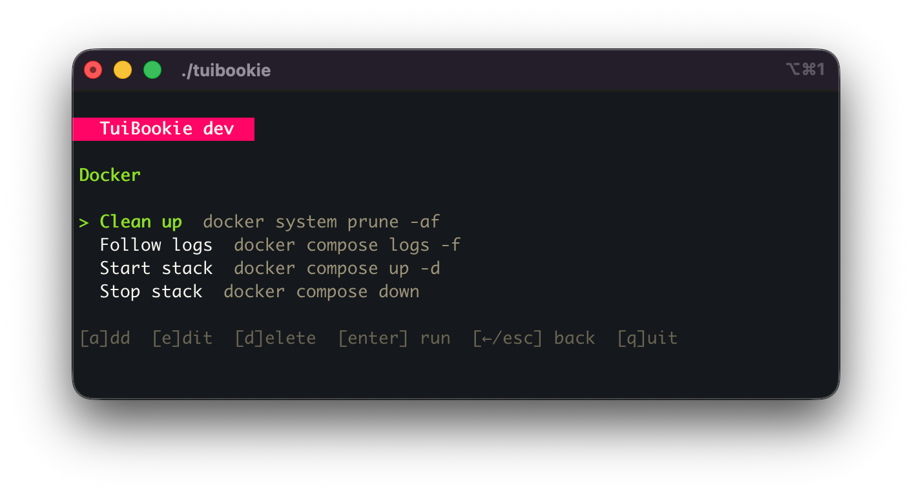
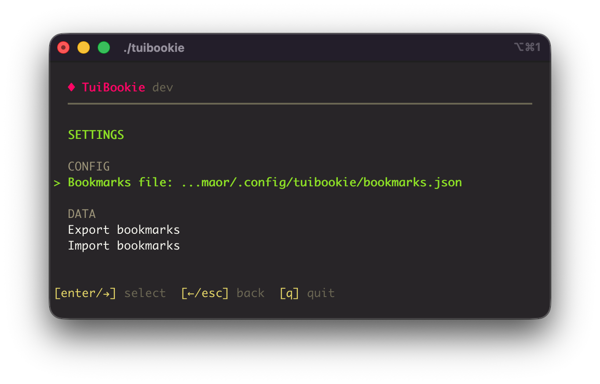

<p align="center">
  
</p>

<h1 align="center">TuiBookie</h1>

<p align="center">
  A fast, interactive terminal bookmark manager for CLI commands.<br>
  Organize your frequently used commands into categories, browse them with an intuitive Terminal User Interface, and execute with a single keypress.
</p>

## Features

Built with [Bubble Tea](https://github.com/charmbracelet/bubbletea), [Huh](https://github.com/charmbracelet/huh), and [Lip Gloss](https://github.com/charmbracelet/lipgloss) from the Charm ecosystem.


- **Interactive TUI** — Navigate bookmarks and categories with arrow keys
- **Categories** — Add, rename, and delete categories
- **Import/Export** — Back up your bookmarks to JSON and import from backup files
- **Configurable storage** — Choose where your bookmarks file lives
- **Any CLI command** — SSH, rsync, docker, kubectl, or any command you use regularly

## Screenshots

**Browse categories** — See all your command groups at a glance with bookmark counts.


**Browse bookmarks** — Drill into a category to see commands. Select one and press Enter to run it.



**Settings** — Export your bookmarks as a backup or import from a JSON file.



## Installation

### Quick install (recommended)

Automatically downloads the latest release for your OS and architecture:

```bash
curl -sL https://raw.githubusercontent.com/orvad/tuibookie/main/install.sh | sh
```

### Homebrew (macOS and Linux)

```bash
brew tap orvad/tuibookie
brew install tuibookie
```

### Download manually

Download the latest binary from the [Releases page](https://github.com/orvad/tuibookie/releases):

| Platform | Binary |
|---|---|
| macOS (Apple Silicon) | `tuibookie-darwin-arm64` |
| macOS (Intel) | `tuibookie-darwin-amd64` |
| Linux (x86_64) | `tuibookie-linux-amd64` |
| Linux (ARM64) | `tuibookie-linux-arm64` |

Then make it executable and move it to your PATH:

```bash
chmod +x tuibookie-*
sudo mv tuibookie-* /usr/local/bin/tuibookie
```

### Build from source

Requires [Go](https://go.dev/dl/) 1.26 or later:

```bash
git clone https://github.com/orvad/tuibookie.git
cd tuibookie
go build -o tuibookie .
sudo mv tuibookie /usr/local/bin/
```

#### Cross-compilation

```bash
# Linux (amd64)
GOOS=linux GOARCH=amd64 go build -o tuibookie .

# Linux (arm64)
GOOS=linux GOARCH=arm64 go build -o tuibookie .

# macOS (Apple Silicon)
GOOS=darwin GOARCH=arm64 go build -o tuibookie .

# macOS (Intel)
GOOS=darwin GOARCH=amd64 go build -o tuibookie .
```

## Usage

```bash
tuibookie
```

### Navigation

The app uses a stack-based navigation model. Use arrow keys or vim-style keys to move around:

#### Category list (root view)

| Key | Action |
|---|---|
| `Up` / `k` | Move cursor up |
| `Down` / `j` | Move cursor down |
| `Enter` / `Right` / `l` | Open selected category |
| `a` | Add a new category |
| `e` | Rename selected category |
| `d` | Delete selected category |
| `s` | Open settings (import/export) |
| `q` / `Esc` | Quit |

#### Bookmark list (inside a category)

| Key | Action |
|---|---|
| `Up` / `k` | Move cursor up |
| `Down` / `j` | Move cursor down |
| `Enter` | Run the selected command |
| `a` | Add a new bookmark |
| `e` | Edit selected bookmark |
| `d` | Delete selected bookmark |
| `Left` / `Esc` / `h` | Go back to categories |
| `q` | Quit |

#### Settings view

| Key | Action |
|---|---|
| `Up` / `k` | Move cursor up |
| `Down` / `j` | Move cursor down |
| `Enter` / `Right` / `l` | Execute selected action |
| `Left` / `Esc` / `h` | Go back to categories |
| `q` | Quit |

Settings provides:

- **Export bookmarks** — Saves a backup to the current working directory as `bookmarks-backup-YYYY-MM-DD-HHMMSS.json`
- **Import bookmarks** — Lists `.json` files in the current directory to choose from, or lets you enter a file path manually. Imported bookmarks are merged into existing categories.

#### Forms (add/edit)

| Key | Action |
|---|---|
| `Enter` | Submit the form |
| `Esc` | Cancel and go back |
| `Tab` | Next field (multi-field forms) |

## Configuration

### Bookmarks file location

By default, bookmarks are stored at:

```
~/.config/tuibookie/bookmarks.json
```

Override this with:

```bash
# CLI flag (highest priority)
tuibookie --config /path/to/bookmarks.json

# Environment variable
export TUIBOOKIE_CONFIG=/path/to/bookmarks.json
tuibookie
```

Priority order: `--config` flag > `TUIBOOKIE_CONFIG` env var > default path.

The config directory and file are created automatically on first run.

### Bookmarks file format

The bookmarks file is plain JSON. Each key is a category name, and the value is an array of bookmarks with `name` and `cmd` fields:

```json
{
  "servers": [
    {
      "cmd": "ssh deploy@10.0.1.50",
      "name": "deploy"
    },
    {
      "cmd": "ssh root@10.0.1.50 -p 2222",
      "name": "root (custom port)"
    }
  ],
  "docker": [
    {
      "cmd": "docker compose up -d",
      "name": "start stack"
    },
    {
      "cmd": "docker compose logs -f",
      "name": "follow logs"
    }
  ],
  "misc": [
    {
      "cmd": "rsync -avz ./dist/ user@server:/var/www/",
      "name": "deploy frontend"
    },
    {
      "cmd": "kubectl get pods -n production",
      "name": "check prod pods"
    }
  ]
}
```

The `cmd` field can be any valid shell command. You can edit this file manually — the app will pick up changes on next launch.

## License

MIT License
