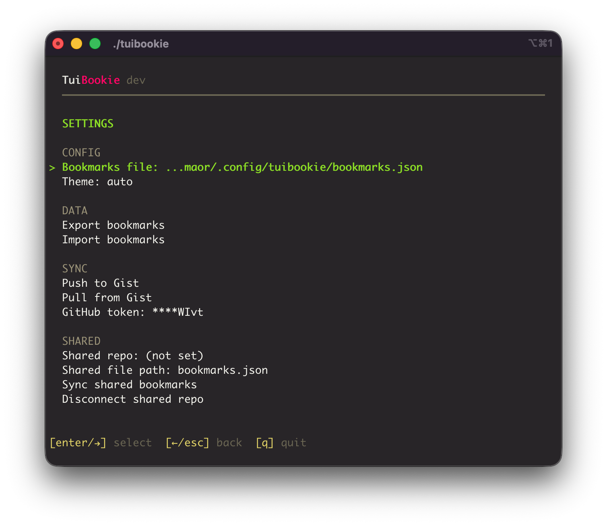
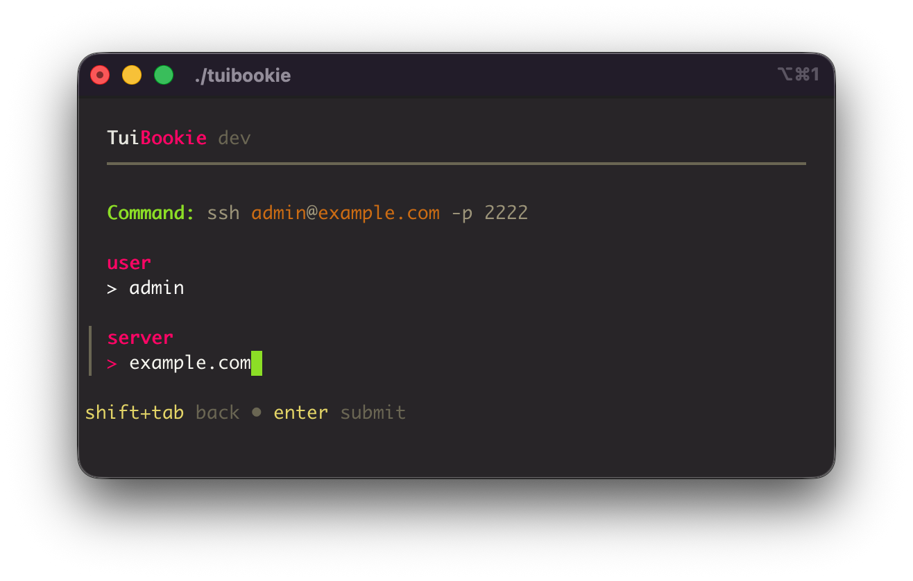

<p align="center">
  
</p>

<h1 align="center">TuiBookie</h1>

<p align="center">
  A fast, interactive terminal bookmark manager for CLI commands.<br>
  Organize your frequently used commands into categories, browse them with an intuitive Terminal User Interface, and execute with a single keypress.
</p>

## Features

Built with [Bubble Tea](https://github.com/charmbracelet/bubbletea), [Huh](https://github.com/charmbracelet/huh), and [Lip Gloss](https://github.com/charmbracelet/lipgloss) from the Charm ecosystem.


- **Interactive TUI** — Navigate bookmarks and categories with arrow keys
- **Categories** — Add, rename, and delete categories
- **Import/Export** — Back up your bookmarks to JSON and import from backup files
- **Gist Sync** — Push your bookmarks to a secret GitHub Gist and pull them on any machine. Versioned backup with full revision history, powered by a Personal Access Token.
- **Shared Bookmarks via Git** — Sync shared bookmarks from any git repo for collaborative work. Read-only repos are detected automatically.
- **Configurable storage** — Choose where your bookmarks file lives
- **Any CLI command** — SSH, rsync, docker, kubectl, or any command you use regularly

## Screenshots

**Browse categories** — See all your command groups at a glance with bookmark counts.


**Browse bookmarks** — Drill into a category to see commands. Select one and press Enter to run it.


**Settings** — Configure your bookmarks file path, export backups, or import from a JSON file.



**Parameterized commands** — Define reusable parameters in your commands and fill them in at run time.



## Installation

### Quick install (recommended)

Automatically downloads the latest release for your OS and architecture:

```bash
curl -sL https://raw.githubusercontent.com/orvad/tuibookie/main/install.sh | sh
```

### Homebrew (macOS and Linux)

```bash
brew tap orvad/tuibookie
brew install tuibookie
```

### Download manually

Download the latest binary from the [Releases page](https://github.com/orvad/tuibookie/releases):

| Platform | Binary |
|---|---|
| macOS (Apple Silicon) | `tuibookie-darwin-arm64` |
| macOS (Intel) | `tuibookie-darwin-amd64` |
| Linux (x86_64) | `tuibookie-linux-amd64` |
| Linux (ARM64) | `tuibookie-linux-arm64` |

Then make it executable and move it to your PATH:

```bash
chmod +x tuibookie-*
sudo mv tuibookie-* /usr/local/bin/tuibookie
```

### Build from source

Requires [Go](https://go.dev/dl/) 1.26 or later:

```bash
git clone https://github.com/orvad/tuibookie.git
cd tuibookie
go build -o tuibookie .
sudo mv tuibookie /usr/local/bin/
```

#### Cross-compilation

```bash
# Linux (amd64)
GOOS=linux GOARCH=amd64 go build -o tuibookie .

# Linux (arm64)
GOOS=linux GOARCH=arm64 go build -o tuibookie .

# macOS (Apple Silicon)
GOOS=darwin GOARCH=arm64 go build -o tuibookie .

# macOS (Intel)
GOOS=darwin GOARCH=amd64 go build -o tuibookie .
```

## Usage
In your terminal enter:
```bash
tuibookie
```

## Parameterized commands

Commands can include named parameters using `{{name}}` or `{{name:default}}` syntax. When you run a parameterized command, TuiBookie prompts you for each parameter value before executing.

- **`{{name}}`** — prompts for a value with no default
- **`{{name:default}}`** — prompts for a value, pre-filled with the default

For example, a bookmark with the command:

```
ssh {{user:admin}}@{{server}}
```

will prompt for `user` (pre-filled with `admin`) and `server` before running. A live preview of the resolved command updates as you type.

In the bookmark list, parameters are highlighted so you can tell at a glance which commands will prompt for input. Commands without parameters run immediately as before.

## Confirm before execute

By default, commands fire immediately when you press Enter — that's the whole point of TuiBookie. But some commands are dangerous, and you may want a safety net before running them. Individual bookmarks can be marked to require confirmation: when you add or edit a bookmark, set **"Confirm before execute?"** to Yes. Bookmarks with confirmation enabled show a bold pink **!** indicator in the list, and pressing Enter will display the resolved command in a confirmation dialog — you must confirm with `y` before it runs. This is useful for commands like `rm -rf`, `kubectl delete`, or anything you don't want to fire accidentally.

## Shared bookmarks via Git

TuiBookie can sync shared bookmarks from a git repository, letting teams maintain a common set of commands alongside their personal bookmarks.

### How it works

1. Go to **Settings > Shared repo** and enter a git clone URL (SSH or HTTPS)
2. Optionally set a custom file path within the repo (defaults to `bookmarks.json`)
3. Select **Sync shared bookmarks** — TuiBookie clones the repo and loads the bookmarks

Shared bookmarks appear in a separate section below your local bookmarks, marked with a `◆ SHARED` header. When both local and shared bookmarks exist, drill-in views show a breadcrumb like `SHARED › KUBERNETES` so you always know which group you're in.

### Sync behavior

- **On startup** — shared bookmarks load instantly from the cached local clone. A background git pull fetches updates without blocking the UI.
- **Manual sync** — press `S` (capital) in the category view, or use **Sync shared bookmarks** in Settings.
- **On edit** — adding, editing, or deleting a shared bookmark triggers an immediate commit and push to the remote repo.

### Read-only repos

TuiBookie detects read-only access on first sync. When a repo is read-only, the section header shows `◆ SHARED (READ-ONLY)` and add/edit/delete keys are disabled with a status message. This lets you share a curated set of bookmarks with users who shouldn't modify them.

### Requirements

- `git` must be installed and available in your PATH
- Authentication is handled by your existing git setup (SSH keys, credential helpers, tokens)

## Settings provides:

- **Bookmarks file** — View and change the path to your bookmarks JSON file. When switching, you'll see a confirmation with the number of categories and bookmarks in the target file. If the file doesn't exist, you can create a new empty one.
- **Export bookmarks** — Saves a backup to the current working directory as `bookmarks-backup-YYYY-MM-DD-HHMMSS.json`
- **Import bookmarks** — Lists `.json` files in the current directory to choose from, or lets you enter a file path manually. Imported bookmarks are merged into existing categories.
- **Push to Gist** — Uploads your bookmarks to a secret GitHub Gist. On first push, a new gist is created; subsequent pushes update it.
- **Pull from Gist** — Downloads bookmarks from your gist and replaces the local file. Shows a confirmation with category and bookmark counts before overwriting.
- **GitHub token** — Set or remove the Personal Access Token used for Gist sync. The token is stored in `config.json` and displayed masked in the UI.
- **Shared repo** — Set the git clone URL for a shared bookmarks repository.
- **Shared file path** — Set the path to the bookmarks file within the shared repo (defaults to `bookmarks.json`).
- **Sync shared bookmarks** — Pull the latest shared bookmarks from the remote repo.
- **Disconnect shared repo** — Remove the shared repo configuration and clear shared bookmarks from the app.

## Configuration

### Config file

On first launch, TuiBookie creates a config file at:

```
~/.config/tuibookie/config.json
```

This stores your app settings, starting with the bookmarks file path. You can change the bookmarks path directly from the Settings view in the TUI — no flags needed.

### Bookmarks file location

By default, bookmarks are stored at:

```
~/.config/tuibookie/bookmarks.json
```

You can change this in the Settings view, or override with flags for scripting:

```bash
# CLI flag (highest priority)
tuibookie --config /path/to/bookmarks.json

# Environment variable
export TUIBOOKIE_CONFIG=/path/to/bookmarks.json
tuibookie
```

Priority order: `--config` flag > `TUIBOOKIE_CONFIG` env var > `config.json` setting > default path.

The config directory and files are created automatically on first run.

## Contributing

Contributions are welcome and encouraged! Whether it's a bug fix, new feature, or improvement to the docs — please feel free to open an issue or submit a pull request.

See [CONTRIBUTING.md](CONTRIBUTING.md) for guidelines on how to get started.

## License

MIT

## Support

<a href="https://www.buymeacoffee.com/orvad" target="_blank"></a>

**Why buy me a coffee?** — TuiBookie is free and open-source, built and maintained in my spare time. If it saves you a few keystrokes or sparks joy, a coffee is always deeply appreciated. Thanks :heart:
