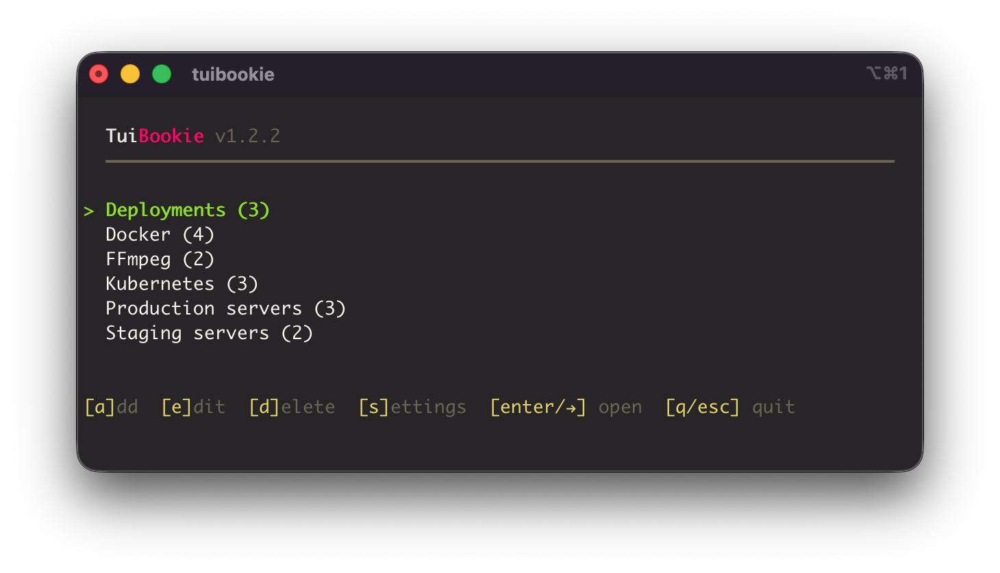

<p align="center">
  
</p>

<h1 align="center">TuiBookie</h1>

<p align="center">
  A fast, interactive terminal bookmark manager for CLI commands.<br>
  Organize your frequently used commands into categories, browse them with an intuitive Terminal User Interface, and execute with a single keypress.
</p>

<p align="center">
  <a href="https://docs.tuibookie.dev">Documentation</a> ·
  <a href="https://tuibookie.dev">Website</a> ·
  <a href="https://github.com/orvad/tuibookie/releases">Releases</a>
</p>

<p align="center">
  
</p>

## Quick Install

```bash
curl -sL https://raw.githubusercontent.com/orvad/tuibookie/main/install.sh | sh
```

Or with Homebrew:

```bash
brew tap orvad/tuibookie
brew install tuibookie
```

See the [Installation guide](https://docs.tuibookie.dev/installation/) for all methods including manual download and building from source.

## Features

- **Interactive TUI** — Navigate bookmarks and categories with arrow keys
- **Parameterized Commands** — Add `{{variables}}` to commands with runtime prompts
- **Confirm Before Execute** — Safety net for dangerous commands
- **Gist Sync** — Push bookmarks to a secret GitHub Gist and pull on any machine
- **Shared Bookmarks via Git** — Sync team bookmarks from any git repo
- **Import/Export** — Back up and restore bookmarks as JSON
- **Any CLI command** — SSH, rsync, docker, kubectl, or anything you run regularly

Read more in the [full documentation](https://docs.tuibookie.dev).

## Contributing

Contributions are welcome! See [CONTRIBUTING.md](CONTRIBUTING.md) for guidelines.

## License

MIT

## Support

<a href="https://www.buymeacoffee.com/orvad" target="_blank"></a>

**Why buy me a coffee?** — TuiBookie is free and open-source, built and maintained in my spare time. If it saves you a few keystrokes or sparks joy, a coffee is always deeply appreciated. Thanks :heart:
